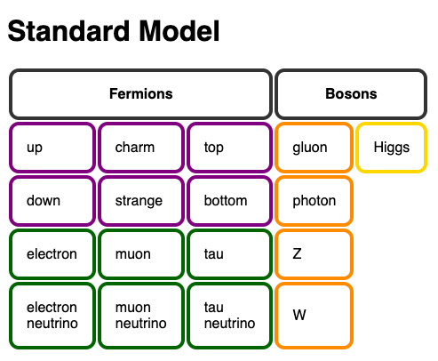

# Physics Explorer

This is a physics app built with vanilla JavaScript. It's an exercise to learn
web development fundamentals, using the simplest technology stack: plain HTML,
CSS, & client-side JS.

## Exercise Constraints
- No libraries, frameworks, templates, or preprocessors
- No server side processing (e.g. Node or Deno)
- No dev tools except Git, an editor, and a web browser

## Goals
- [x] Show the fundamental particles

